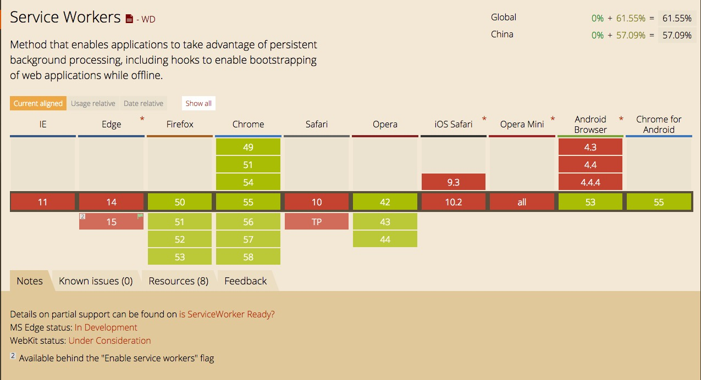

## 出现的背景

有一个困扰web用户多年的难题：网络不可连接（离线）。即使是世界上最好的web app，如果你下载不了它，用户体验基本是毁了。已经有很多种技术尝试，来解决这一问题。随着离线页面的出现，一些问题已经得到了解决。但是，最重要的问题是，仍然没有一个好的统筹机制，来对缓存和网络请求进行控制。

之前的尝试 — APPCache — 看起来是个不错的方法，因为它可以很容易地指定需要离线缓存的资源。但是，这个方法假定了你使用时会遵循很多规则，如果你不严格遵循这些规则，它会把你的APP搞得一团糟。关于APPCache的更多详情，请看Jake Archibald的文章： [Application Cache is a Douchebag.](http://alistapart.com/article/application-cache-is-a-douchebag)

## 是什么

Service worker是一个注册在指定源和路径下的事件驱动worker。它采用JavaScript控制关联的页面或者网站，拦截并修改访问和资源请求，细粒度地缓存资源。你可以完全控制应用在特定情形（最常见的情形是网络不可用）下的表现。

Service worker运行在worker上下文，因此它不能访问DOM。相对于驱动应用的主JavaScript线程，它运行在其他线程中，所以不会造成阻塞。它设计为完全异步，同步API（如XHR和localStorage）不能在service worker中使用。

出于安全考量，Service workers只能由HTTPS承载，毕竟修改网络请求的能力暴露给中间人攻击会非常危险。在Firefox浏览器的用户隐私模式，Service Worker不可用。

## 应用场景

Service workers也可以用来做这些事情：

+ 后台数据同步
+ 响应来自其它源的资源请求
+ 集中接收计算成本高的数据更新，比如地理位置和陀螺仪信息，这样多个页面就可以利用同一组数据
+ 在客户端进行CoffeeScript，LESS，CJS/AMD等模块编译和依赖管理（用于开发目的）
+ 后台服务钩子
+ 自定义模板用于特定URL模式
+ 性能增强，比如预取用户可能需要的资源，比如相册中的后面数张图片
+ 未来service workers能够用来做更多使web平台接近原生应用的事。 值得关注的是，其他标准也能并且将会使用service worker，例如:

+ 后台同步：启动一个service worker即使没有用户访问特定站点，也可以更新缓存
+ 响应推送：启动一个service worker向用户发送一条信息通知新的内容可用
+ 对时间或日期作出响应
+ 进入地理栅栏

## 浏览器支持情况

## 使用Service Workers前的设置

## Worker 生命周期

## 参考链接

+ [http://www.html5rocks.com/en/tutorials/service-worker/introduction/](http://www.html5rocks.com/en/tutorials/service-worker/introduction/)
+ [https://developer.mozilla.org/zh-CN/docs/Web/API/Service_Worker_API/Using_Service_Workers](https://developer.mozilla.org/zh-CN/docs/Web/API/Service_Worker_API/Using_Service_Workers)
+ [https://developer.mozilla.org/zh-CN/Apps/Fundamentals/Offline](https://developer.mozilla.org/zh-CN/Apps/Fundamentals/Offline)